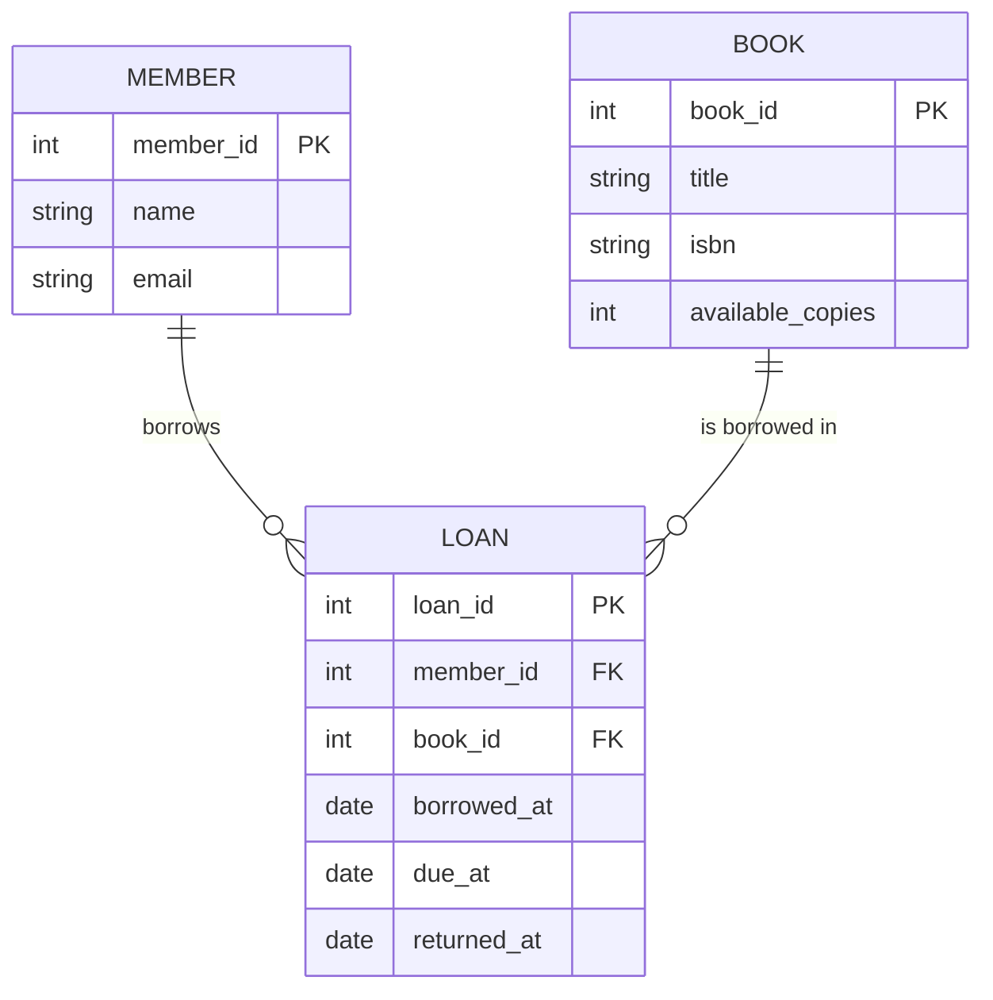

# Generative AI for Software Developer - วันที่ 2: Agentic Coding, MCP & Software Design

**หลักสูตรอบรมเชิงปฏิบัติการ: Generative AI for Software Developer (ฉบับ 5 วัน ปี 2026)**
**จัดอบรมให้: ธนาคารการค้าต่างประเทศลาว มหาชน (BCEL)**
**วันที่ 2: ใช้ AI Coding Agent จริง, เชื่อมข้อมูลด้วย MCP และออกแบบระบบด้วย AI**
วันที่: 21 กรกฎาคม 2569 (2026) | เวลา 09:30-16:30 น. | Onsite Workshop
ผู้สอน: อ.สามิตร โกยม | IT Genius Engineering Co., Ltd.

---

## 🎯 วัตถุประสงค์การเรียนรู้ประจำวัน

เมื่อจบการอบรมวันที่ 2 ผู้เรียนจะสามารถ:

1. แยกแยะเครื่องมือ AI Coding 3 รูปแบบ (Inline, Chat, Autonomous Agent) และเลือกใช้ให้เหมาะกับงาน
2. ใช้ AI Coding Agent วางแผนและสร้างฟีเจอร์แบบ end-to-end ตามวงจร Plan → Edit → Run → Verify พร้อมเทคนิคกำกับ Agent
3. อธิบายสถาปัตยกรรมและประโยชน์ของ MCP (Model Context Protocol) และเชื่อม AI เข้ากับ GitHub, Filesystem และฐานข้อมูลได้
4. ใช้ AI ช่วยออกแบบระบบ สร้าง UML/ERD/Sequence/Architecture Diagram และร่าง OpenAPI Spec
5. ใช้ AI อ่านและปรับปรุง Legacy Code ทำ Refactoring และทำ AI Code Review หา Bug กับช่องโหว่ความปลอดภัยก่อน Merge
6. ลงมือสั่ง Agent สร้าง API + Database Schema + Diagram, ติดตั้ง MCP Server และทำ Code Review บน Legacy Code จริง (Workshop Day 2)

> **หมายเหตุ:** วันนี้เราจะใช้ไฟล์ `AGENTS.md` ที่เขียนไว้เมื่อวานเป็นแกนกำกับ Agent เครื่องมือหลักที่ใช้สาธิตคือ **Claude Code**, **Cursor** และ **GitHub Copilot Agent Mode** หลักการเหมือนกันทุกตัว ผู้เรียนใช้ตัวที่ถนัด/องค์กรอนุมัติได้

---

## 🧭 กำหนดการวันที่ 2 (โดยสังเขป)

| เวลา | หัวข้อ |
| ----------- | ------------------------------------------------------------ |
| 09:30-09:45 | ทบทวนวันที่ 1 + เปิดประเด็นวันที่ 2 |
| 09:45-11:00 | **Module 4** AI Coding Assistant & Agentic Coding |
| 11:00-11:15 | พักเบรก |
| 11:15-12:00 | **Module 5** MCP - เชื่อม AI เข้ากับเครื่องมือและข้อมูลจริง |
| 12:00-13:00 | พักกลางวัน |
| 13:00-14:00 | **Module 6** AI กับ Software Design & System Architecture |
| 14:00-15:00 | **Module 7** Legacy Code, Refactoring & AI Code Review |
| 15:00-15:15 | พักเบรก |
| 15:15-16:30 | **Workshop Day 2** สร้าง API + Diagram, ติดตั้ง MCP, ทำ Code Review |

---

## 🔁 ทบทวนวันที่ 1 (09:30-09:45)

> เมื่อวานเราวางรากฐานว่า LLM ทำงานอย่างไร และฝึก Context Engineering + เขียน `AGENTS.md` วันนี้เราจะ "ปล่อยให้ AI ลงมือทำงานจริง" ในฐานะ Agent ที่แก้โค้ดหลายไฟล์ได้ โดยมี `AGENTS.md` เป็นกติกากำกับ และมี MCP เป็นสะพานเชื่อม AI เข้าถึงข้อมูลจริงขององค์กร

---

## 📚 Module 4: AI Coding Assistant & Agentic Coding

### เวลา 09:45-11:00 น.

> 💡 **หัวใจของ Module นี้:** ความต่างระหว่าง "AI เติมโค้ด" กับ "AI Agent" คือ Agent **ลงมือทำเองได้หลายขั้น** ทั้งอ่านไฟล์ แก้ไข รันคำสั่ง ดู error แล้วแก้ต่อ วนจนงานเสร็จ บทบาทเราเปลี่ยนจาก "คนพิมพ์" เป็น "คนกำกับและตรวจ"

---

### 4.1 สามรูปแบบของเครื่องมือ AI Coding

```text
1) Inline Suggestion          2) Chat Assistant           3) Autonomous Agent
┌───────────────────┐        ┌───────────────────┐       ┌───────────────────┐
│ เดาโค้ดบรรทัดถัดไป   │        │ ถาม-ตอบข้างจอ      │       │ วางแผน+แก้หลายไฟล์  │
│ กด Tab เพื่อรับ     │  ⟶    │ อธิบาย/แก้ snippet │  ⟶   │ รันคำสั่ง+เทสต์เอง    │
│ ขอบเขต: บรรทัดเดียว │        │ ขอบเขต: ไฟล์เดียว  │       │ ขอบเขต: ทั้งฟีเจอร์  │
└───────────────────┘        └───────────────────┘       └───────────────────┘
  เร็ว แต่ไม่เห็นภาพรวม          เห็นบริบทมากขึ้น            ทำงานแทนได้ แต่ต้องกำกับ
```

| รูปแบบ | เหมาะกับ | ความเสี่ยงที่ต้องระวัง |
| --- | --- | --- |
| Inline Suggestion | เขียนโค้ดซ้ำ ๆ boilerplate | รับมั่ว ๆ โดยไม่อ่าน |
| Chat Assistant | ถามความรู้ อธิบาย แก้จุดเล็ก | copy โค้ดโดยไม่เข้าใจ |
| Autonomous Agent | ฟีเจอร์ใหม่ทั้งชุด, refactor ใหญ่ | Agent แก้เกินขอบเขต ต้อง review diff เสมอ |

### 4.2 เครื่องมือ Agentic Coding ปี 2026

| เครื่องมือ | รูปแบบ | จุดเด่น |
| --- | --- | --- |
| **Claude Code** | CLI/Terminal Agent | ทำงานใน terminal อ่านทั้ง repo, ใช้ `CLAUDE.md`, ต่อ MCP ได้ |
| **Cursor** | AI-first IDE (fork VS Code) | Agent Mode ในตัว, เข้าใจ codebase, ใช้ `AGENTS.md` |
| **GitHub Copilot Agent Mode** | ปลั๊กอิน VS Code / GitHub | ผูกกับ GitHub/PR แน่น, มอบหมายงานเป็น issue ได้ |
| **Windsurf** | AI IDE | Flow ทำงานต่อเนื่อง เข้าใจบริบทหลายไฟล์ |
| **OpenAI Codex** | Cloud/CLI Agent | รันงานแบบ background, สร้าง PR ให้ |

> 📌 **หลักการที่อยู่ทน:** เครื่องมือเปลี่ยนได้ แต่แนวคิด "Agent วางแผน-แก้-รัน-ตรวจ ภายใต้กติกาและการกำกับของมนุษย์" เหมือนกันหมด เรียนหลักการนี้ให้แม่น แล้วย้ายเครื่องมือได้ทันที

### 4.3 วงจรการทำงานของ Agent: Plan → Edit → Run → Verify

```text
        ┌──────────────────────────────────────────────┐
        │                                              │
        ▼                                              │
   [1 PLAN]        [2 EDIT]        [3 RUN]       [4 VERIFY]
   วางแผนว่า   ─▶  แก้/สร้าง   ─▶  รันโค้ด/    ─▶  ตรวจผล เจอ error
   จะทำอะไร       ไฟล์ที่เกี่ยว     เทสต์          ─┐  → วนกลับไปแก้
   ทีละขั้น                                        │
                                                   ▼
                                          [เสร็จ] มนุษย์ review diff → อนุมัติ
```

หัวใจคือ **Agent ปิด loop ได้เอง** (แก้ → รัน → เห็น error → แก้ต่อ) ต่างจาก Chat ที่หยุดแค่ให้โค้ด เราแค่กำกับทิศและตรวจปลายทาง

### 4.4 เทคนิคการกำกับ Agent ให้ได้งานดี

| เทคนิค | ทำอย่างไร | ทำไมสำคัญ |
| --- | --- | --- |
| **ให้ทำ Plan ก่อนลงมือ** | "วางแผนเป็นขั้น ๆ ก่อน รอฉันอนุมัติค่อยลงมือ" | เห็นทิศทางก่อนเสียเวลาแก้ผิด |
| **ซอยงานเล็ก (Small Steps)** | สั่งทีละฟีเจอร์ย่อย ไม่เหมาโจทย์ใหญ่ก้อนเดียว | Agent แม่นขึ้น, review ง่ายขึ้น |
| **ให้บริบทที่ถูก** | ชี้ไฟล์/โฟลเดอร์ที่เกี่ยวข้อง + `AGENTS.md` | ลดการเดา ลด hallucination |
| **Review Diff ทุกครั้ง** | อ่านสิ่งที่ Agent เปลี่ยนก่อน commit | จับของแปลก/เกินขอบเขต |
| **คุมขอบเขต (Scope Guard)** | "ห้ามแตะไฟล์อื่นนอกจาก X" | กัน Agent ไปแก้ที่ไม่ควรแก้ |
| **ให้เกณฑ์ว่า 'เสร็จ' คืออะไร** | "ถือว่าเสร็จเมื่อ test ผ่านทั้งหมด" | Agent รู้เป้าหมายชัด |

> ⚠️ **ข้อควรระวังสำคัญ:** อย่ารัน Agent ในโหมด "อนุมัติทุกอย่างอัตโนมัติ (auto-approve)" บนโปรเจกต์สำคัญ โดยเฉพาะคำสั่งที่ลบไฟล์/แก้ฐานข้อมูล/deploy ให้คงจุดที่มนุษย์กดยืนยันไว้เสมอ (Human-in-the-loop)

---

## 📚 Module 5: MCP - เชื่อม AI เข้ากับเครื่องมือและข้อมูลจริง

### เวลา 11:15-12:00 น.

> 💡 **หัวใจของ Module นี้:** ปกติ AI รู้แค่สิ่งที่เราพิมพ์ให้ MCP คือ "มาตรฐานสายเชื่อม" ที่ทำให้ AI เอื้อมไปหยิบข้อมูลจริง (GitHub, ฐานข้อมูล, ไฟล์) และใช้เครื่องมือจริงได้อย่างปลอดภัยและเป็นระบบ

---

### 5.1 MCP คืออะไร และทำไมถูกเรียกว่า "USB-C ของโลก AI"

**Model Context Protocol (MCP)** คือมาตรฐานเปิด (โดย Anthropic ปี 2024 และกลายเป็นมาตรฐานอุตสาหกรรม) ที่กำหนด "วิธีมาตรฐาน" ให้ AI เชื่อมกับแหล่งข้อมูลและเครื่องมือภายนอก

```text
ก่อนมี MCP (วุ่นวาย M×N):              มี MCP (มาตรฐานเดียว M+N):
AI แต่ละตัว × เครื่องมือแต่ละตัว          AI พูด "ภาษา MCP" ตัวเดียว
= ต้องเขียน integration ทุกคู่            เครื่องมือเปิด "MCP Server" ตัวเดียว
┌────┐  ┌────┐  ┌────┐                  ┌────┐   ┌─────────┐   ┌────────┐
│AI-A│──│Git │  │ DB │                  │ AI │──▶│  MCP    │──▶│ GitHub │
└────┘\/└────┘\/└────┘                  └────┘   │ (สายกลาง)│──▶│  DB    │
      /\      /\                                 └─────────┘──▶│ Files  │
   ต่อกันมั่วไปหมด                                  เสียบครั้งเดียวใช้ได้หมด
```

เหมือน USB-C ที่ "หัวเดียวเสียบได้ทุกอุปกรณ์" MCP ทำให้ "AI ตัวไหนก็เชื่อมเครื่องมือไหนก็ได้" ถ้าทั้งคู่พูด MCP

### 5.2 สถาปัตยกรรม MCP: Host, Client, Server

```text
┌─────────────────────── MCP Host (เช่น Claude Code, Cursor) ───────────────────────┐
│                                                                                   │
│   ┌──────────────┐         JSON-RPC over stdio/HTTP        ┌──────────────────┐   │
│   │  MCP Client  │ ◀─────────────────────────────────────▶│   MCP Server     │   │
│   │ (ในตัว Host)  │      "มีเครื่องมืออะไรบ้าง?" /            │  (GitHub/DB/FS)  │   │
│   └──────────────┘      "เรียกเครื่องมือนี้ที"                └──────────────────┘   │
│                                                                     │             │
└─────────────────────────────────────────────────────────────────────┼─────────────┘
                                                                       ▼
                                                          ข้อมูล/ระบบจริง (repo, ตาราง, ไฟล์)
```

| องค์ประกอบ | หน้าที่ | ตัวอย่าง |
| --- | --- | --- |
| **Host** | แอปที่ผู้ใช้ทำงานด้วย มี LLM อยู่ | Claude Code, Cursor, Claude Desktop |
| **Client** | ตัวกลางใน Host ที่คุยกับ Server | ส่วนหนึ่งของ Host จัดการ protocol |
| **Server** | เปิดเครื่องมือ/ข้อมูลออกมาให้ AI ใช้ | GitHub MCP, Postgres MCP, Filesystem MCP |

สิ่งที่ MCP Server เปิดให้ใช้ได้มี 3 ประเภทหลัก:

- **Tools** - ฟังก์ชันที่ AI เรียกทำงานได้ (เช่น `create_issue`, `run_query`)
- **Resources** - ข้อมูลที่ AI อ่านได้ (เช่น เนื้อไฟล์, ผลลัพธ์ query)
- **Prompts** - เทมเพลตคำสั่งสำเร็จรูปที่ Server เตรียมไว้

> 📌 การสื่อสารใช้ **JSON-RPC 2.0** ผ่าน stdio (โปรเซสในเครื่อง) หรือ HTTP (ระยะไกล) วันนี้เราเน้น "ใช้ MCP Server ที่มีคนทำไว้แล้ว" ส่วน "สร้าง MCP Server เอง" จะลงลึกในวันที่ 4 (Section 15)

### 5.3 ตัวอย่างการเชื่อม AI เข้ากับข้อมูลจริงผ่าน MCP

| MCP Server | ทำให้ AI ทำอะไรได้ | ตัวอย่างคำสั่ง |
| --- | --- | --- |
| **Filesystem** | อ่าน/เขียนไฟล์ในโฟลเดอร์ที่อนุญาต | "อ่านทุกไฟล์ใน /docs แล้วสรุป" |
| **GitHub** | อ่าน issue/PR, สร้าง branch, comment | "เปิด PR review และสรุป comment ทั้งหมด" |
| **Postgres / MySQL** | query ฐานข้อมูล (อ่าน) | "นับจำนวน order เดือนนี้แยกตามสถานะ" |
| **Slack** | อ่าน/ส่งข้อความ | "สรุปข้อความในช่อง #incident วันนี้" |

**ตัวอย่างการตั้งค่า MCP Server (รูปแบบ config มาตรฐาน):**

```json
{
  "mcpServers": {
    "filesystem": {
      "command": "npx",
      "args": ["-y", "@modelcontextprotocol/server-filesystem", "/path/to/project"]
    },
    "github": {
      "command": "npx",
      "args": ["-y", "@modelcontextprotocol/server-github"],
      "env": { "GITHUB_PERSONAL_ACCESS_TOKEN": "<token>" }
    }
  }
}
```

### 5.4 ความปลอดภัยและสิทธิ์เมื่อให้ AI เชื่อมข้อมูลจริง

การเปิดให้ AI เอื้อมถึงข้อมูลจริงมีพลังมาก และมีความเสี่ยงมากตามไปด้วย โดยเฉพาะในธนาคาร:

| ความเสี่ยง | แนวป้องกัน |
| --- | --- |
| AI เข้าถึงข้อมูลเกินจำเป็น | ให้สิทธิ์แบบ **least privilege** เปิดเฉพาะโฟลเดอร์/ตารางที่ต้องใช้ |
| เขียน/ลบข้อมูลจริงโดยไม่ตั้งใจ | ใช้สิทธิ์ **read-only** กับฐานข้อมูล production |
| Token/Credential รั่ว | เก็บใน env/secret manager ห้าม hardcode |
| Prompt Injection ผ่านข้อมูลที่อ่านเข้ามา | ตรวจสอบ/จำกัดคำสั่งที่ Agent ทำได้ (ลงลึกวันที่ 5) |

> ⚠️ **กฎสำหรับงานธนาคาร:** ในห้องเรียนให้ต่อ MCP กับ **ข้อมูลจำลอง/repo ตัวอย่าง** เท่านั้น ห้ามต่อกับระบบจริงของ BCEL หลักการที่เรียนนำไปปรับใช้กับสภาพแวดล้อมที่ควบคุมได้ภายหลัง

---

## 📚 Module 6: AI กับ Software Design & System Architecture

### เวลา 13:00-14:00 น.

> 💡 **หัวใจของ Module นี้:** AI ไม่ได้เก่งแค่เขียนโค้ด แต่ช่วย "คิดก่อนเขียน" ได้ดีมาก ทั้งออกแบบ API ร่าง schema สร้าง diagram และเทียบ trade-off ของสถาปัตยกรรม ทำให้ช่วงออกแบบเร็วขึ้นหลายเท่า

---

### 6.1 สร้าง Diagram จาก Prompt ด้วย Mermaid / PlantUML

เราให้ AI สร้าง diagram เป็น "โค้ด" (Diagram-as-Code) ที่ version control ได้ แก้ง่าย ไม่ต้องลากกล่องเอง รูปแบบยอดนิยมคือ **Mermaid** (เรนเดอร์ได้ใน Markdown/GitHub) และ **PlantUML**

**ตัวอย่าง Prompt:** "ออกแบบ ER Diagram สำหรับระบบยืม-คืนหนังสือห้องสมุด (member, book, loan) เป็น Mermaid"



AI ช่วยสร้าง diagram ได้หลายชนิด:

| ชนิด Diagram | ใช้ตอนไหน |
| --- | --- |
| **ERD** | ออกแบบฐานข้อมูล ความสัมพันธ์ตาราง |
| **Sequence Diagram** | ลำดับการเรียกระหว่างระบบ/service |
| **Class/UML** | โครงสร้าง class และความสัมพันธ์ |
| **Architecture / Flowchart** | ภาพรวมระบบ, data flow |

### 6.2 ใช้ AI ออกแบบ API และร่าง OpenAPI Spec

AI ช่วยร่าง API ตามแนวทาง RESTful หรือ GraphQL และเขียน **OpenAPI Spec** ที่นำไปสร้าง docs, mock server และ client SDK ต่อได้ทันที

**ตัวอย่าง Prompt:** "ออกแบบ REST API สำหรับจัดการบัญชีผู้ใช้ (CRUD) ตามแนวทาง RESTful เขียนเป็น OpenAPI 3.1 (YAML) พร้อม validation และ error response มาตรฐาน"

```yaml
openapi: 3.1.0
info:
  title: User Management API
  version: 1.0.0
paths:
  /users:
    get:
      summary: List users
      parameters:
        - name: page
          in: query
          schema: { type: integer, default: 1 }
      responses:
        '200':
          description: OK
    post:
      summary: Create user
      requestBody:
        required: true
        content:
          application/json:
            schema: { $ref: '#/components/schemas/NewUser' }
      responses:
        '201': { description: Created }
        '400': { description: Validation error }
components:
  schemas:
    NewUser:
      type: object
      required: [name, email]
      properties:
        name:  { type: string, minLength: 1 }
        email: { type: string, format: email }
```

### 6.3 ใช้ AI ประเมินทางเลือกเชิงสถาปัตยกรรม (Trade-off Analysis)

AI ช่วยเป็น "คู่คิด" เปรียบเทียบทางเลือกได้ดี เช่นถามว่า "ระบบแจ้งเตือนควรใช้ REST polling, WebSocket หรือ Message Queue เทียบ trade-off ด้าน latency, ความซับซ้อน, cost และ scale ให้หน่อย"

> ✅ **แนวทางใช้ให้ได้ผล:** ให้ AI ทำเป็น "ตารางเปรียบเทียบ + คำแนะนำตามบริบทเรา" ไม่ใช่ถามลอย ๆ ระบุข้อจำกัดจริง เช่น "ทีมเล็ก 3 คน, ต้อง realtime, งบจำกัด" แล้ว AI จะแนะนำได้ตรงขึ้น

> ⚠️ **ข้อควรระวัง:** AI เสนอทางเลือกได้ดี แต่ **การตัดสินใจสุดท้ายเป็นของสถาปนิก/ทีม** เพราะ AI ไม่รู้บริบทองค์กร ข้อจำกัดด้าน compliance และทีมทั้งหมด ใช้ AI เป็น "ตัวเร่งการคิด" ไม่ใช่ "คนตัดสินใจแทน"

### 6.4 เทคนิค Craft Prompt สำหรับงานออกแบบ

```text
[บทบาท]    คุณคือ Software Architect ประสบการณ์สูง
[บริบท]    ระบบ ... ผู้ใช้ ... ปริมาณ traffic ... ข้อจำกัด (compliance/งบ/ทีม)
[งาน]      ออกแบบ ... เสนอ 2-3 ทางเลือก
[ผลลัพธ์]  ตารางเปรียบเทียบ trade-off + diagram (Mermaid) + คำแนะนำ
[เงื่อนไข] ถ้าข้อมูลไม่พอให้ถามก่อนออกแบบ
```

---

## 📚 Module 7: Legacy Code, Refactoring & AI Code Review

### เวลา 14:00-15:00 น.

> 💡 **หัวใจของ Module นี้:** งานจริงส่วนใหญ่ไม่ใช่เขียนใหม่ แต่คือ "แก้ของเก่าที่ไม่มีเอกสาร" AI เก่งมากในการอ่านโค้ดที่เราไม่คุ้น อธิบาย ทำ reverse engineering และช่วยรีวิวหาบั๊ก/ช่องโหว่ก่อน merge

---

### 7.1 ให้ AI อธิบายและทำ Reverse Engineering โค้ดเก่า

เมื่อเจอโค้ดเก่าที่ไม่มีเอกสาร ให้ AI ช่วย:

```text
1) "อธิบายว่าโค้ดไฟล์นี้ทำอะไร ทีละฟังก์ชัน สำหรับคนที่เพิ่งเข้าโปรเจกต์"
2) "วาด Sequence Diagram (Mermaid) ของ flow การทำงานหลัก"
3) "ชี้จุดที่เสี่ยงบั๊ก, จุดที่ performance อาจแย่ และ dependency ที่ล้าสมัย"
4) "สรุป input/output และ side-effect ของฟังก์ชันหลัก"
```

### 7.2 Refactoring อย่างปลอดภัยด้วย AI

หลักการทองของการ refactor คือ **"เปลี่ยนโครงสร้าง ไม่เปลี่ยนพฤติกรรม"** วิธีทำงานกับ AI ให้ปลอดภัย:

```text
ก่อน refactor:  [มี test ครอบพฤติกรรมเดิมก่อน] ── ถ้ายังไม่มี ให้ AI ช่วยเขียน test ก่อน
     │
     ▼
สั่ง refactor:  "รีแฟกเตอร์ให้อ่านง่ายขึ้น แยกฟังก์ชันย่อย ตั้งชื่อสื่อความหมาย
                โดยไม่เปลี่ยนพฤติกรรม และ test เดิมต้องยังผ่านทั้งหมด"
     │
     ▼
หลัง refactor:  [รัน test ชุดเดิม] ── ผ่าน = ปลอดภัย, ไม่ผ่าน = ย้อนกลับ
```

| งาน Refactor ที่ AI ช่วยได้ดี | ตัวอย่าง |
| --- | --- |
| แยกฟังก์ชันใหญ่เป็นย่อย | ฟังก์ชัน 200 บรรทัด → หลายฟังก์ชันชัดเจน |
| ตั้งชื่อใหม่ให้สื่อความหมาย | `d`, `tmp` → `dueDate`, `pendingLoans` |
| ลบโค้ดซ้ำ (DRY) | รวม logic ที่ copy หลายที่ |
| เพิ่ม comment/JSDoc | ให้เอกสารกับโค้ดที่ไม่มี |
| ยกระดับ syntax เก่า | callback → async/await |

### 7.3 AI Code Review - ด่านตรวจก่อน Merge

ให้ AI เป็น "reviewer คนแรก" ตรวจงานก่อนส่งให้เพื่อนรีวิว ช่วยจับของง่าย ๆ ที่คนมักพลาด ทำให้ human review โฟกัสเรื่องสำคัญ

**สิ่งที่ AI Code Review ควรตรวจ:**

```text
[ ] Bug / logic error         (เงื่อนไขผิด, off-by-one, null handling)
[ ] Security                  (SQL injection, XSS, secret ที่ hardcode)
[ ] Performance               (N+1 query, loop ซ้อนที่แพง)
[ ] Error handling            (จับ error ครบ, ไม่กลืน exception เงียบ ๆ)
[ ] Readability / naming      (ชื่อสื่อความหมาย, ฟังก์ชันไม่ยาวเกิน)
[ ] Test coverage             (มี test ครอบ edge case ไหม)
[ ] Convention               (ตรงมาตรฐานทีมใน AGENTS.md ไหม)
```

**ตัวอย่าง Prompt สำหรับ Code Review:**

```text
คุณคือ Senior Security-minded Reviewer
รีวิว diff/โค้ดนี้ตาม checklist: bug, security, performance, error handling,
naming, test coverage และมาตรฐานใน AGENTS.md
- จัดลำดับความรุนแรง (Critical / Major / Minor)
- แต่ละประเด็นบอก "ปัญหา + เหตุผล + วิธีแก้ที่แนะนำ"
- ถ้าไม่พบปัญหาในหมวดใด ให้บอกว่า "ผ่าน"
```

> ⚠️ **ข้อจำกัดที่ต้องรู้:** AI Code Review จับของทั่วไปได้ดี แต่ **ไม่เข้าใจบริบทธุรกิจลึก** และอาจ "มั่นใจผิด" ได้ ยังต้องมี human review เสมอ โดยเฉพาะโค้ดที่เกี่ยวกับเงิน/ความปลอดภัยของธนาคาร ใช้ AI เป็น "ด่านแรก" ไม่ใช่ "ด่านเดียว"

### 7.4 Use case: อ่านและปรับปรุงโค้ดหลายภาษา

AI อ่านและช่วยปรับปรุงได้ทั้ง Java, Python, TypeScript, C# ฯลฯ เหมาะกับองค์กรที่มีระบบเก่าหลายภาษา แนวทางใช้งาน: ให้บริบทภาษา/เฟรมเวิร์ก/เวอร์ชัน แล้วขอทั้ง "คำอธิบาย + จุดเสี่ยง + ข้อเสนอปรับปรุงแบบทีละขั้น" เพื่อให้ทีมค่อย ๆ ปรับปรุงได้อย่างปลอดภัย

---

## 🛠️ Workshop Day 2 - Agent สร้างระบบ, MCP และ Code Review

### เวลา 15:15-16:30 น.

> **เป้าหมาย:** ให้ผู้เรียนได้ใช้ Agent สร้างงานจริงแบบ end-to-end, เชื่อม MCP Server หนึ่งตัว และทำ Code Review บน Legacy Code ที่วิทยากรเตรียมไว้

---

### 🧪 Lab 2.1 - สั่ง Agent สร้าง API + Schema + Diagram แบบ end-to-end

**โจทย์:** สร้าง Mini API สำหรับระบบ "จองห้องประชุม" (Meeting Room Booking)

**ขั้นตอน:**

```text
ขั้นที่ 1  ให้ Agent วางแผนก่อน:
   "วางแผนสร้าง REST API ระบบจองห้องประชุม (room, booking)
    ด้วย Node.js + Express (หรือ Python + FastAPI)
    ทำเป็นขั้น ๆ ก่อน รอฉันอนุมัติค่อยลงมือ ใช้กติกาใน AGENTS.md"

ขั้นที่ 2  อนุมัติแผน แล้วให้ลงมือทีละขั้น (สร้าง schema → endpoint → validation)

ขั้นที่ 3  ให้สร้าง ERD (Mermaid) และ Sequence Diagram ของ flow การจอง

ขั้นที่ 4  รันจริง + ทดสอบด้วย curl/Postman ว่าใช้งานได้

ขั้นที่ 5  Review diff ทั้งหมด: Agent ทำตาม AGENTS.md ครบไหม
```

> ✅ **จุดที่ต้องสังเกต:** Agent วางแผนสมเหตุสมผลไหม, ต้องกำกับกี่ครั้ง, review เจอปัญหาอะไร - บันทึกไว้เทียบกับการเขียนเองว่าเร็วขึ้นแค่ไหน

### 🧪 Lab 2.2 - ติดตั้งและทดลอง MCP Server

**โจทย์:** เชื่อม AI Agent เข้ากับ **Filesystem MCP** (หรือ GitHub MCP ถ้ามี token)

```text
ขั้นที่ 1  เพิ่ม config MCP Server (ตามรูปแบบหัวข้อ 5.3) ชี้ไปโฟลเดอร์ตัวอย่าง
ขั้นที่ 2  รีสตาร์ท Host แล้วยืนยันว่า Agent เห็น tools ของ MCP Server
ขั้นที่ 3  สั่งงานผ่าน MCP เช่น "อ่านทุกไฟล์ใน docs/ แล้วสรุปเป็น README"
ขั้นที่ 4  (ถ้าใช้ GitHub MCP) "สรุป issue ที่เปิดอยู่ทั้งหมดในรูปตาราง"
```

> ⚠️ ให้ชี้ MCP ไปที่โฟลเดอร์/repo ตัวอย่างเท่านั้น และให้สิทธิ์ read-only ก่อนเสมอ

### 🛠️ Workshop หลัก - AI Code Review บน Legacy Code

**โจทย์:** วิทยากรแจกไฟล์โค้ดเก่าที่ "จงใจฝังปัญหา" ไว้ (เช่น SQL injection, null handling พลาด, ฟังก์ชันยาวเกิน, ไม่มี test) ให้ผู้เรียน:

```text
[ ] 1. ให้ AI อธิบายว่าโค้ดทำอะไร + วาด Sequence Diagram
[ ] 2. ให้ AI ทำ Code Review ตาม checklist (หัวข้อ 7.3) จัดลำดับความรุนแรง
[ ] 3. เลือกปัญหา Critical 1-2 ข้อ ให้ AI ช่วย refactor แก้ไข
[ ] 4. ให้ AI เขียน test ครอบพฤติกรรม แล้วรันยืนยันว่าแก้แล้วไม่พัง
[ ] 5. ตรวจเอง: AI พลาดอะไรไหม มีข้อไหนที่ AI "มั่นใจผิด"
```

### 🧩 ความท้าทายเสริม (ถ้าทำเสร็จก่อนเวลา)

- ให้ 2 โมเดล (เช่น Claude กับ ChatGPT) รีวิวโค้ดเดียวกัน แล้วเทียบว่าจับปัญหาต่างกันอย่างไร
- เพิ่มกฎ Code Review ลงใน `AGENTS.md` เป็น checklist ประจำทีม
- ลองต่อ Postgres/MySQL MCP (read-only) กับฐานข้อมูลตัวอย่าง แล้วให้ AI ช่วยสรุปข้อมูล

---

## 📝 สรุปประจำวันที่ 2

| หัวข้อ | สิ่งที่ทำได้แล้ว |
| --- | --- |
| Module 4 - Agentic Coding | แยก 3 รูปแบบเครื่องมือ และใช้ Agent ตามวงจร Plan-Edit-Run-Verify |
| Module 5 - MCP | เข้าใจสถาปัตยกรรม Host/Client/Server และเชื่อม MCP Server จริง |
| Module 6 - Software Design | ใช้ AI สร้าง Diagram, ร่าง OpenAPI และเทียบ trade-off สถาปัตยกรรม |
| Module 7 - Legacy & Review | อ่าน/refactor โค้ดเก่า และทำ AI Code Review ตาม checklist |
| ★ Workshop Day 2 | Agent สร้าง API+Diagram, ต่อ MCP และรีวิว Legacy Code จริง |

### ✅ ตรวจสอบความพร้อมก่อนวันพรุ่งนี้

> ให้แน่ใจว่า:
>
> - ใช้ AI Coding Agent (Claude Code / Cursor / Copilot Agent) สร้างงานได้อย่างน้อย 1 ชิ้น
> - ต่อ MCP Server ได้อย่างน้อย 1 ตัว และเข้าใจแนวคิด Host/Client/Server
> - ทำ AI Code Review เป็น และรู้ว่า AI จับอะไรได้/พลาดอะไร
> - เข้าใจว่า "Review Diff เสมอ" และ "Human-in-the-loop" คือหลักที่ต้องยึด
> - พร้อมสำหรับวันที่ 3 ที่จะสร้าง Prototype/UI, Chatbot RAG เบื้องต้น และ Testing

---

**💡 คำคมประจำวัน:**

> "AI Agent ทำงานแทนมือเราได้ แต่แทนความรับผิดชอบเราไม่ได้ - หน้าที่ใหม่ของเราคือกำกับให้ดีและตรวจให้เป็น"

---

## 📖 References วันที่ 2

- Model Context Protocol - เว็บไซต์ทางการ: https://modelcontextprotocol.io/
- Model Context Protocol - Specification: https://modelcontextprotocol.io/specification/2025-11-25
- Anthropic - Claude Code Documentation: https://docs.claude.com/en/docs/claude-code/overview
- GitHub - Copilot Documentation: https://docs.github.com/en/copilot
- Cursor - Documentation: https://docs.cursor.com/
- Mermaid - Diagramming syntax: https://mermaid.js.org/
- OpenAPI Specification: https://spec.openapis.org/oas/latest.html

---

_เอกสารจัดทำโดย: อาจารย์สามิตร โกยม | IT Genius Engineering Co., Ltd._
_สำหรับการอบรม: ธนาคาร BCEL (สปป.ลาว)_
_หลักสูตร Generative AI for Software Developer (ฉบับ 5 วัน 2026) - วันที่ 2 จาก 5_
